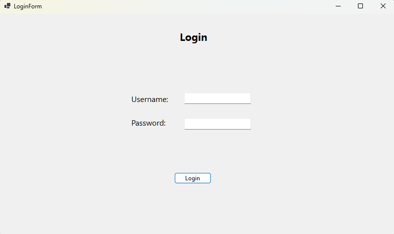
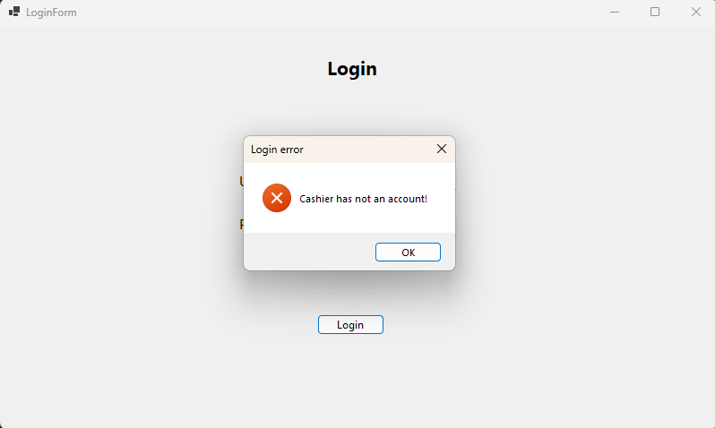
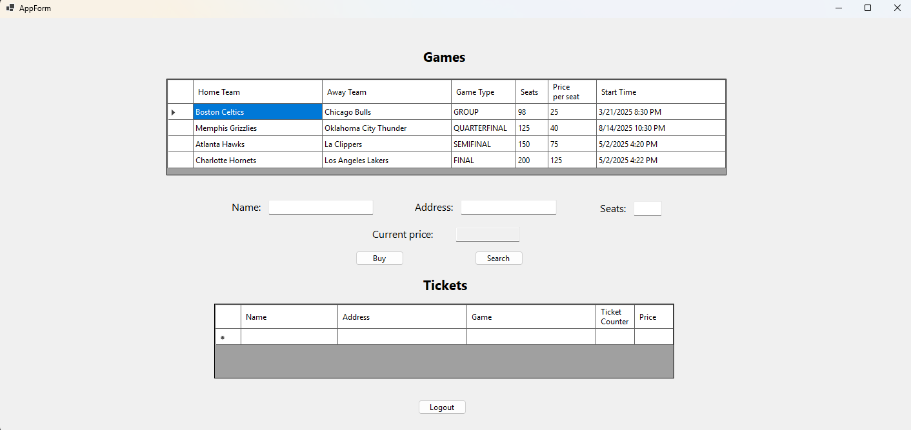
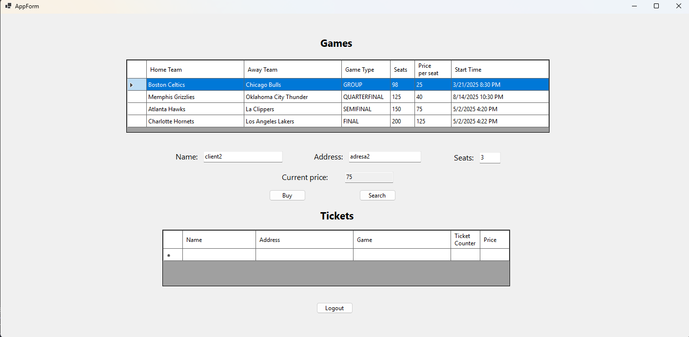
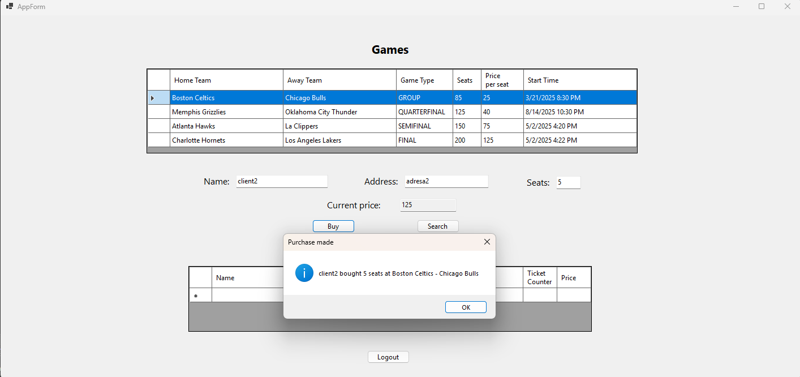

<h1>BasketballClientServer</h1>

<h2>Description:</h2>

  BasketballClientServer is a desktop GUI application built with Windows Forms in C# for handling basketball match ticket sales.

<h2>Functionalities:</h2>
<ul>
  <li>
    Tickets for any unsold-out match can be purchased by entering the customer's identification details (name and address) into the system and using 'Buy' button.
  </li>
  <li>
    All previous purchases made by a customer (identified by name and address), or by all customers matching the entered name, can be accessed by the cashier using 'Search' button.
  </li>
</ul>

<h2>
  Technologies used:
</h2>
<ul>
  <li>
    C#
  </li>
  <li>
    .NET 9 (for runtime)
  </li>
  <li>
    Windows Forms (for GUI)
  </li>
  <li>
    SQLite (for data storage)
  </li>
</ul>

<h2>
  User scenario:
</h2>
<ol>
  <li>
    

      After launching the application, the cashier must log in using their account credentials.
    

    
    

      If the information entered by the cashier is <b>incorrect</b> (not associated with an existing account), an appropriate error message is displayed and the user is required to return to the previous step.
    

    
  </li>
    
  <li>
    

      After logging in, the cashier is redirected to the main application window, which provides access to all functionalities available for their role. From this interface, the cashier can perform tasks such as registering transactions, viewing transaction history, and logout from his account.
    

    
    <ol>
      <li>
        

          To register a transaction, the cashier inputs the customer's details, specifies the desired number of seats, selects the basketball game from the 'Games' table, and press 'Buy' button.
          After selecting the desired game, if the entered number of seats is valid, the total ticket cost will be displayed.
        

        
        
      </li>

      
    </ol>
  </li>
</ol>

