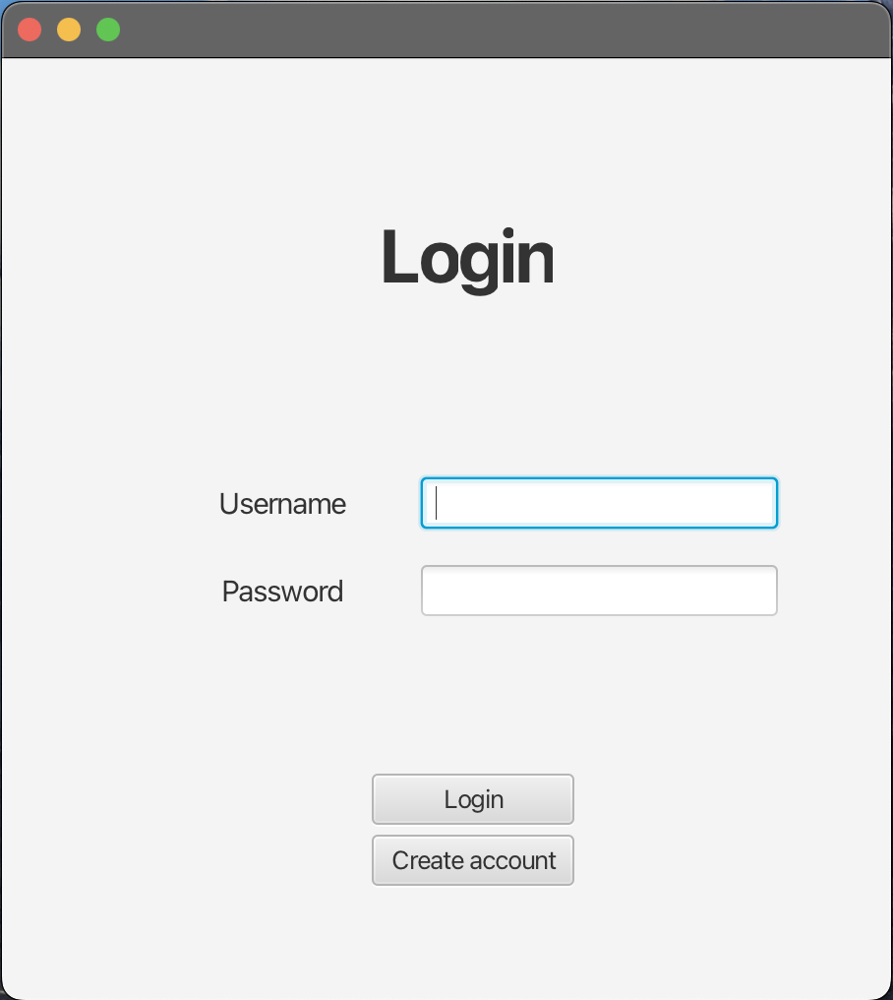
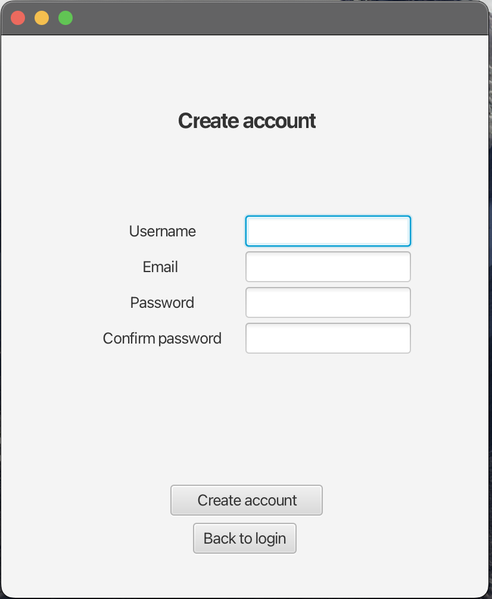
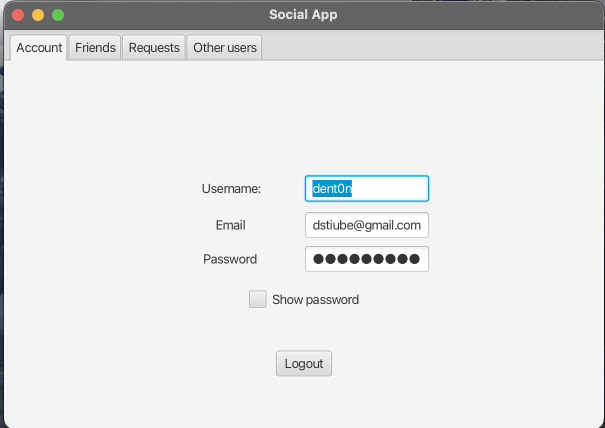
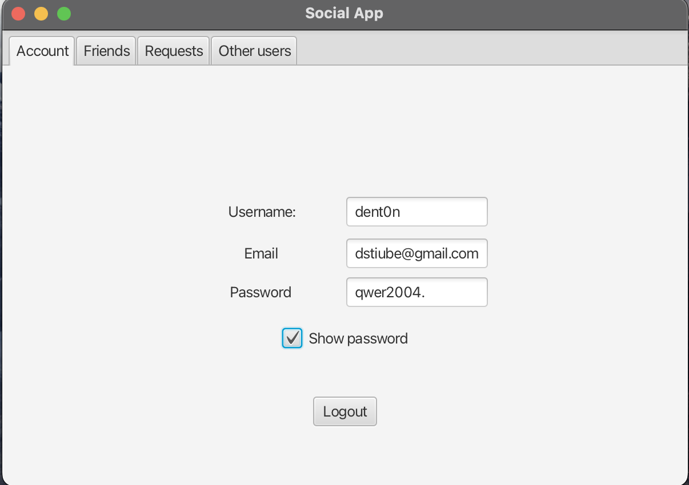
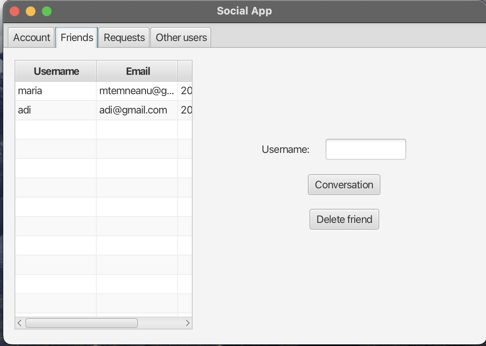
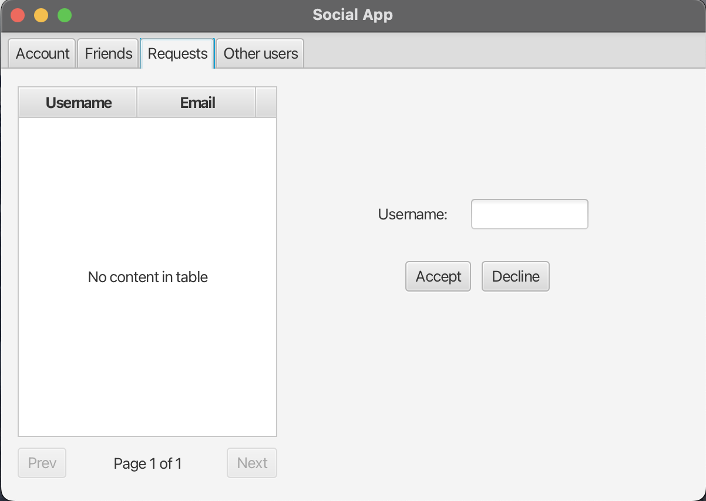
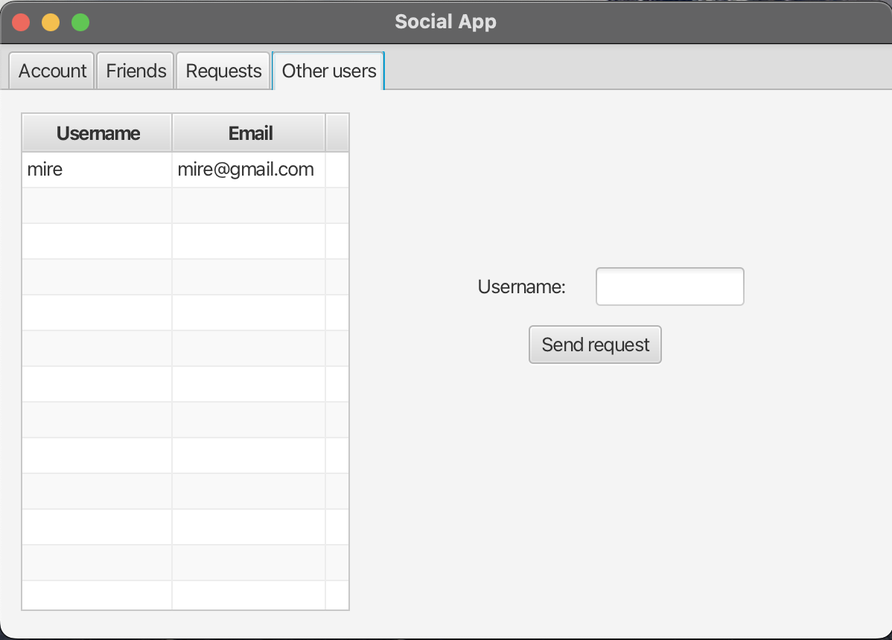

<h1>Social Network</h1>

<h2>Description: </h2>

  SocialNetwork is a software app developed in Java. 

  The purpose of this app is to facilitate the chatting between users <b>(it only works locally)</b>. Every user needs an account to use the app (at the first use, he will create a new account).

<h2>Functionalities: </h2>
<ul>
  <li>
    Any user can send a <b>friend request</b> to any other user (who is <b>not</b> already a friend).
  </li>
  <li>
    A user who receives a friend request can accept it to become <b>friend</b> with the sender of friend request or can remove it if he doesn't want him as a friend.
  </li>
  <li>
    A user can only send messages to friends. He can choose to send a message to a <b>specific friend</b> or to <b>group of friends</b>.
  </li>
</ul>

<h2>Technologies used: </h2>
<ul>
  <li>
    Java
  </li>
  <li>
    JavaFX (for GUI)
  </li>
  <li>
    PostgreSQL (for storing data)
  </li>
</ul>

<h2>Use cases: </h2>
<ol>
  <li>
    
After launching the app, it will be displayed a window for logging in the account.

    
  </li>
  <li>
    
If the user is new or he wants one more account, he has to press <i>Create Account</i> button. After this the app will display a window where user must introduce
      a username, email address and password to create the new account.
    

    
  </li>
  <li>
    

      After connecting successfully in the account, it will be displayed a window with more tabs (<b>About</b>, <b>Friends</b>, <b>Requests</b> and <b>Others</b>). The current tab
      will be <i>About</i>.
    

    
    
<i>About</i> tab contains information about account. The password wil be hidden by default. If the user press on the checkbox, then the password will be
      visible.

    
  </li>
  <li>
    

      <i>Friends</i> tab contains a table with friends' usernames and email addresses, a search bar by username and 2 buttons:
      <ul>
        <li>
          <i>Conversation</i>: After pressing this button, user can send messages to user/users selected.
        </li>
        <li>
          <i>Delete friend</i>: This button will delete the selected friend from friends list. The removed friend will appear in <i>others</i> section.
        </li>
      </ul>
    

    
  </li>
  <li>
    

      <i>Requests</i> tab contains a table with received requests from non-friend users, a search bar by username and 2 buttons:
      <ul>
        <li>
          <i>Accept</i>: To accept the request, users will become friends.
        </li>
        <li>
          <i>Decline</i>: To decline the request, users will not be friends.
        </li>
      </ul>
    

    
  </li>
  <li>
    
<i>Others</i> tab contains a table with the non-friend and non-requested users, a search bar by username and a button for sending friend request.

    
  </li>
</ol>

